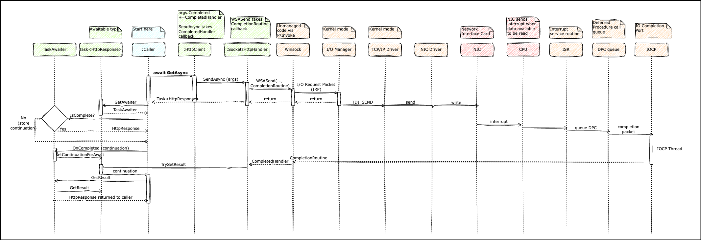

<span class="credit">Photo by <a href="https://unsplash.com/@albertstoynov?utm_content=creditCopyText&utm_medium=referral&utm_source=unsplash">Albert Stoynov</a> on <a href="https://unsplash.com/photos/a-train-pulling-into-a-train-station-next-to-a-platform-ILu5lrvtkE0?utm_content=creditCopyText&utm_medium=referral&utm_source=unsplash">Unsplash</a></span>
  

See parts [1](/blog/async-programming-1), [2](/blog/async-programming-2) and [3](/blog/async-programming-3) for context.

### The Awaitable/Awaiter Pattern

The awaitable/awaiter pattern is used to block program execution (but not the thread) until the async operation completes and return its result to the caller as though it were a synchronous call.

An async method runs synchronously until an `await` is encountered. At this point, it checks to see if the async operation is already complete (which might happen if there is an input validation error, or the result was returned from a cache for example). If yes, then it just gets the result of the operation and the program proceeds synchronously. If no, then it captures and sets a continuation to be invoked on completion and returns an awaiter instance. The continuation is generated behind the scenes by the pattern as a state machine (which we will examine in the next post). When the async operation is complete, the continuation runs (likely on a different thread) and updates the result of the operation in the task instance, which is available to the caller through the awaiter.

What is an awaiter? Conceptually, it is an object that suspends program execution until an operation has completed and helps obtain the result of the operation. The thread itself is not blocked or suspended, and can be returned to the thread pool, making it available for other work. When the async operation completes, the program resumes via the continuation callback, possibly on another threadpool thread. It provides a non-blocking way to await an operation.

Awaitable is a type that can be awaited. It has a `GetAwaiter()` method that returns an awaiter. In the case of async/await, `Task` and `Task<T>` are awaitable types. 

Awaitable/Awaiter is a bridge between the caller of the async method and the continuation that runs upon completion. It enables a linear flow of control and intuitive exception handling. JavaScript in its pre-await days suffered from *callback hell*, with flow of control jumping all over the place, and no easy way to return a value locally from an async operation. Awaitable/Awaiter helps avoid all that and write async code that looks and behaves like synchronous code, even though under the hood, the flow of control might be jumping around between threads.    

In the following code:
```clojure
HttpResponse response = await _httpClient.GetAsync(url);
```

`_httpClient.GetAsync(url)` returns a `Task<HttpResponse>` instance. The compiler replaces `await` with a `GetAwaiter()` call on the task instance, which returns an "awaiter"  of type `TaskAwaiter<HttpResponse>`. 

```clojure
TaskAwaiter<HttpResponse> awaiter = _httpClient.GetAsync(url).GetAwaiter();
```

The awaiter as its name suggests, provides a non-blocking way to wait for the async operation to complete. It exposes a `GetResult()` method to return the result (called in the continuation). 
```clojure
HttpResponse response = awaiter.GetResult();
```

Awaitable/Awaiter is not restricted just to task instances, but as Stephen Toub [explains](https://devblogs.microsoft.com/pfxteam/await-anything/), it is a pattern that the language supports to await any instance that exposes a `GetAwaiter` method. In the case of `Task`, `GetAwaiter` returns a `TaskAwaiter` instance. But you could write your own class `Bar` that exposes an awaiter pattern by just implementing a `GetAwaiter` method that returns a `BarAwaiter` instance that implements the `INotifyCompletion` interface and exposes three members, just as `TaskAwaiter` does:
```clojure
bool IsCompleted { get; }
void OnCompleted(Action continuation);
TResult GetResult(); // TResult can also be void
```

[Vasil Kosturski](https://vkontech.com/exploring-the-async-await-state-machine-the-awaitable-pattern/) has an excellent article with an example I recommend you try yourself to get a feel for the pattern. In a nutshell, when an `await` is encountered, the awaiter's `IsCompleted` is checked. If true, then the code proceeds synchronously to execute `GetResult()`. If false, then it means the operation is in progress, and `OnCompleted` is called to register the continuation. When the async I/O completes, the associated task is set to complete (using `Task.TrySetResult`) and the registered continuations scheduled to run. The continuation has access to the antecedent task, and can call `GetResult()` to obtain its result.

### Asynchronous I/O Operations Deep Dive

Here, a question arises: how does the system know when the async operation completes? We have to dive into the deep end of the pool to understand this. 

##### Winsock
The async call to a framework method such as `_httpClient.GetAsync` invokes `SocketsHttpHandler` behind the scenes which makes a Windows Socket API (Winsock) call through P/Invoke (managed to unmanaged code interface). Winsock initiates an I/O operation in asynchronous mode, registers a callback function and returns immediately. 

##### TCP/IP driver
To do this it creates an I/O request packet (IRP) for the I/O manager. This IRP has information about the registered callback to invoke on completion of the operation. The I/O Manager is part of the Windows kernel, responsible for managing I/O operations. It routes this IRP to the TCP/IP driver, which runs in kernel mode. The TCP/IP driver interfaces with NICs through device drivers, sending low level frames. 

##### NIC driver, interrupts, DPC
When the NIC receives data back, the NIC driver triggers an interrupt to notify the CPU, which runs an Interrupt Service Routine (ISR) which resets the device and queues up a Deferred Procedure Call (DPC) to handle the interrupt. DPCs are used to defer lower-priority processing in interrupt handlers and device drivers. When the CPU gets around to running the DPC, it invokes the TCP/IP driver to process the received packet. 

##### IOCPs
When the TCP/IP driver is done, it signals completion to the I/O manager, which qeueues up a completion packet containing the received data to an I/O Completion Port (IOCP). IOCPs are a Windows mechanism for efficiently handling multiple asynchronous I/O operations. They are conceptually like a queue serviced by the thread pool (the .NET thread pool has dedicated IOCP processing threads). An IOCP thread from the pool awakens to process the completion packet, extract the result of the I/O operation, and invoke the registered callback (the completion packet has access to the IRP which can be used to identify the callback), which sets the associated task to completed. This in turn triggers the task framework to run the continuation. 

[](../img/async-sequence.png){:data-lightbox="async-sequence" data-title="Async Sequence Diagram"}

<span class="credit">Async Sequence Diagram</span>

All this Herculean effort just so that a thread is not blocked waiting to receive data. This free time for one thread, (which can be significant, since I/O operations can be 100-1000 times slower than CPU operations), multiplied by all the threads doing I/O across the system, can increase server throughput by upto [4x](https://mahdytech.com/2019/02/22/async-throughput-4x/))! 

Another question: what part of this contraption runs for synchronous I/O operations? We would still have IRPs (although they would be synchronous vs asynchronous IRPs), ISRs and DPCs, but no IOCPs are involved (those are specifically for asynchronous I/O), and the TCP/IP driver running in the DPC would return the result directly to the calling thread, which, poor fellow, has been patiently waiting for the result.

### Takeaways
- The awaitable/awaiter pattern is used to enable linear control flow in async code and avoid "callback hell". The pattern generates a state machine that automatically manages continuations and state across multiple async calls.
- Conceptually, awaitable represents a type that can be awaited (`Task` and `Task<T>`).
- The Awaiter blocks execution flow (it does *not* block the thread) until an async operation completes, and obtains the result of the operation for the caller. It bridges the async method call and the continuation. 
- Device drivers are capable of asynchronous processing, returning immediately while accepting a callback function to be called when the device signals completion of the operation, via a chain of interrupts, interrupt service routines (ISRs), deferred procedure calls (DPCs) and IO Completion ports (IOCP). The callback sets result on the associated task and runs the continuation which marks the resumption of program flow after the async operation.


### Further Reading
- [await anything;](https://devblogs.microsoft.com/pfxteam/await-anything/)
- [Exploring the async/await State Machine – The Awaitable Pattern](https://vkontech.com/exploring-the-async-await-state-machine-the-awaitable-pattern/)
- [Asynchronous I/O in C#: I/O Completion Ports](https://dschenkelman.github.io/2013/10/29/asynchronous-io-in-c-io-completion-ports/)
- [Multithreaded Asynchronous I/O & I/O Completion Ports](https://www.drdobbs.com/cpp/multithreaded-asynchronous-io-io-comple/201202921) 
- [Not all Async is Created Equal: How Using Async Correctly Increased Throughput by 4X](https://mahdytech.com/2019/02/22/async-throughput-4x/)