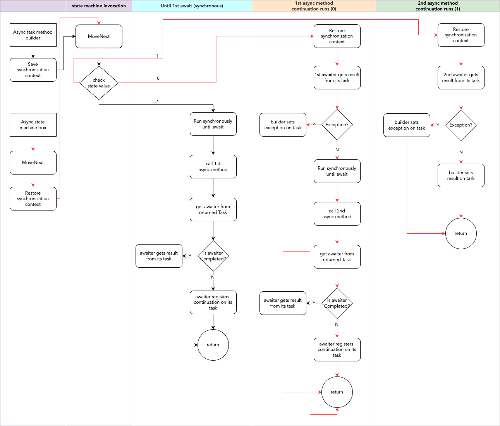

<span class="credit">Photo by <a href="https://unsplash.com/@bradyn?utm_content=creditCopyText&utm_medium=referral&utm_source=unsplash">Bradyn Trollip</a> on <a href="https://unsplash.com/photos/person-holding-white-and-blue-plastic-blocks-pxVOztBa6mY?utm_content=creditCopyText&utm_medium=referral&utm_source=unsplash">Unsplash</a></span>
  
In the [last part](/blog/async-programming-4) and earlier parts, we looked at tasks, continuations and the awaitable/awaiter pattern. In this part, we'll look at the state machine, the final piece of the puzzle.

### State Machine

A state machine, also known as a finite-state machine [^1], is a mathematical model of computation that represents a system as a set of discrete states and transitions between those states based on inputs. We use them every day - traffic lights, elevators, air conditioning systems, microwaves, washing machines, dishwashers, and so on. 

In .NET, state machines are used to model asynchronous methods. They employ a pattern similar to iterators, with a `MoveNext` method for advancing to the next state. They capture the program state at each await point and are responsible for attaching continuations to asynchronous operations. At this point, the state machine is paused. When the async operation completes, callbacks run to update the result on the task instance and mark it as complete. The state machine now resumes, the original context is restored, the registered continuation runs, and executes code synchronously until the next await point is reached, whereupon this process repeats. 

Why do we need a state machine? 

Says Sergey Tepliakov [^2]:
> A regular method has just one entry point and one exit point (it could have more than one return statement but at the runtime there is just one exit point for a given call). But async methods and iterators (methods with yield return) are different. In the case of an async method, a method caller can get the result (i.e. Task or Task<T>) almost immediately and then “await” the actual result of the method via the resulting task.

Thus, an async method can be entered and exited multiple times - similar to a couroutine, a cooperative multitasking construct that allows for execution to be suspended and resumed, with control passing back and forth between the routine and its caller. A mechanism is needed to manage state and context across these transitions. This is what the state machine provides.

### Async Method Builder

The async/await pattern is syntactic sugar beneath which lies a world of task instances, continuations and awaiters as we saw in earlier posts. These constructs are orchestrated in the state machine, which serves as a state repository across the many thread and context transitions that an async method experiences. When the compiler encounters an async method, it replaces its contents with code to build and start this state machine. An async task method builder pattern is used here to facilitate interactions between the state machine and the task infrastructure. The builder is responsible for creating the task instance (representing future value of the asynchronous operation), starting the state machine, flowing context across asynchronous operations, attaching continuations and updating the task instance with the result of the asynchronous operation.

Note that `AsyncTaskMethodBuilder` is implemented as a struct rather than a class for efficiency and performance reasons since it doesn't have much state, and can be allocated right on the stack vs the memory and garbage collection overhead of heap allocation. It stores the following state:
```csharp
private Task<TResult> m_task;
public Task<TResult> Task { get { return m_task ?? InitializeTaskAsPromise(); } }
```

Consider the following console application that calls a web service:
```csharp
class Program
{
    static HttpClient _httpClient;

    static Program()
    {
        _httpClient = new HttpClient();
    }

    static async Task Main(string[] args)
    {
        var activity = await GetActivityAsync();

        Console.WriteLine($"Bored? {activity}.");
    }

    static async Task<string> GetActivityAsync()
    {
        var uri = "https://www.boredapi.com/api/activity";

        var response = await _httpClient.GetAsync(uri);
        
        var content = response.Content;
        
        var responseJson = await content.ReadAsStringAsync();
        
        if (!string.IsNullOrEmpty(responseJson))
        {
            dynamic jObj = JObject.Parse(responseJson);
            var activity = jObj.activity?.ToString();
            return activity;
        }

        return null;
    }
}
```

We can use a decompiler like [ILSpy](https://github.com/icsharpcode/ILSpy) to look at the compiler generated code in the .NET assembly. We see that async method contents have been replaced with a call to spin up and start a state machine, the curiously named `<GetActivityAsync>d__3` struct (compile in release mode to see it - in debug mode a class is created). The state machine creates and holds an async task method builder struct, which is used to start it up, and to create and return the future value of the async operation, i.e. the task instance.       

```csharp
[AsyncStateMachine(typeof(<GetActivityAsync>d__3))]
private static Task<string> GetActivityAsync()
{
    <GetActivityAsync>d__3 stateMachine = default(<GetActivityAsync>d__3);
    stateMachine.<>t__builder = AsyncTaskMethodBuilder<string>.Create();
    stateMachine.<>1__state = -1;
    stateMachine.<>t__builder.Start(ref stateMachine);
    return stateMachine.<>t__builder.Task;
}
```

Peering into the state machine struct `<GetActivityAsync>d__3`, what do we see?
```csharp
private struct <GetActivityAsync>d__3 : IAsyncStateMachine
{
    public int <>1__state;
    public AsyncTaskMethodBuilder<string> <>t__builder;
    private TaskAwaiter<HttpResponseMessage> <>u__1;
    private TaskAwaiter<string> <>u__2;
    private void SetStateMachine(IAsyncStateMachine stateMachine) {...};
    private void MoveNext() {...};
}
```

- It implements an `IAsyncStateMachine` interface with methods `SetStateMachine` and `MoveNext` 
- A state variable (named `<>1__state`) which marks the current state the state machine is in (-1 is initial state, 0 is 1st async operation in progress, 1 is 2nd async operation in progress, -2 is end state)
- an async task method builder (`<>t__builder`) struct reference
- a couple of `TaskAwaiter` references (`<>u__1` and `<>u__2`), one for each awaited async call in the method
- the `SetStateMachine` method which is used to box the state machine on the heap [^3] (no longer used in .NET Core) 
- the `MoveNext` method which resumes the state machine

Note that the state machine is defined as a struct as an optimization. If the asynchronous operation returns immediately, no heap allocation is required. If not, then it is boxed onto the heap (through the `AsyncStateMachineBox` class) prior to the first suspension[^4]. 

`AsyncStateMachineBox` stores and exposes the following properties:
```csharp
public TStateMachine StateMachine;
public ExecutionContext Context;
public Action MoveNextAction;
```

The contents of the original async method `GetActivityAsync` have been relocated to `MoveNext`. The `await` statements have been replaced with `GetAwaiter` calls, followed by registering the continuation (`<>t__builder.AwaitUnsafeOnCompleted(ref awaiter, ref this)`, which calls the awaiter's `OnCompleted` method).

```csharp
private void MoveNext()
{
	int num = <>1__state;
	string result;
	try
	{
		TaskAwaiter<string> awaiter;
		TaskAwaiter<HttpResponseMessage> awaiter2;
		if (num != 0)
		{
			if (num == 1)
			{
				awaiter = <>u__2;
				<>u__2 = default(TaskAwaiter<string>);
				num = (<>1__state = -1);
				goto IL_00d5;
			}
			string uri = "https://www.boredapi.com/api/activity";
			awaiter2 = _httpClient.GetAsync(uri).GetAwaiter();
			if (!awaiter2.IsCompleted)
			{
				num = (<>1__state = 0);
				<>u__1 = awaiter2;
				<>t__builder.AwaitUnsafeOnCompleted(ref awaiter2, ref this);
				return;
			}
		}
		else
		{
			awaiter2 = <>u__1;
			<>u__1 = default(TaskAwaiter<HttpResponseMessage>);
			num = (<>1__state = -1);
		}
		awaiter = awaiter2.GetResult().Content.ReadAsStringAsync().GetAwaiter();
		if (!awaiter.IsCompleted)
		{
			num = (<>1__state = 1);
			<>u__2 = awaiter;
			<>t__builder.AwaitUnsafeOnCompleted(ref awaiter, ref this);
			return;
		}
		goto IL_00d5;
		IL_00d5:
		string responseJson = awaiter.GetResult();
		if (!string.IsNullOrEmpty(responseJson))
		{
			dynamic jObj = JObject.Parse(responseJson);
			dynamic activity = jObj.activity?.ToString();
			result = activity;
		}
		else
		{
			result = null;
		}
	}
	catch (Exception exception)
	{
		<>1__state = -2;
		<>t__builder.SetException(exception);
		return;
	}
	<>1__state = -2;
	<>t__builder.SetResult(result);
}
```

A flowchart can help visualize the phases of the state machine. 

[](../img/state-machine.png)

<span class="credit">State Machine Flow</span>

We can see that this state machine goes through 3 major phases – the synchronous phase until the 1st await, the 1st continuation phase and the 2nd continuation phase. In general, a state machine will go through `n+1` phases where `n` is the number of async method calls in the async method modeled by the state machine.

I refer you back to [part 4](/blog/async-programming-4) for what happens in the depths of the system between the suspension on await and continuation being run upon completion of the asynchronous I/O operation. 

It is worth noting that a state machine is constructed for each method with the `async` qualifier in the program, even if that method has no async method calls. Therefore, even though async improves overall system throughput by releasing blocked threads for other work, an individual async call involves more overhead than a synchronous call, since the state machine and Task instances have to be heap allocated and garbage collected, the context saved and restored. 

What if we have a method such as this which calls an async method, but doesn't await it?

```csharp
private static void Main(string[] args)
{
    Task<string> activityTask = GetActivityAsync();
}
```

No state machine is generated in this case for the `Main` method even though an async method is being called. One will be generated for `GetActivityAsync` though. However, the program will probably terminate before its continuations run.  

This completes our journey into async internals.

### Takeaways
- A state machine is a mathematical model of computation that represents a system as a set of discrete states and transitions between those states based on inputs. 
- A state machine is constructed by the .NET runtime for each and every async method in the program.
- An async method can be entered and exited multiple times. A mechanism is needed to manage state across these transitions. This is what the state machine provides.
- An async task method builder pattern is used to facilitate interactions between the state machine and the task infrastructure. 
- In general, a state machine will go through n+1 phases where n is the number of async method calls in the async method modeled by the state machine.

### References
[^1]:[Wikipedia - Finite-State Machine](https://en.wikipedia.org/wiki/Finite-state_machine)
[^2]:[Dissecting the Async Methods in C#: Sergey Tepliakov](https://devblogs.microsoft.com/premier-developer/dissecting-the-async-methods-in-c/)
[^3]:[How Async Await Really Works](https://devblogs.microsoft.com/dotnet/how-async-await-really-works/)
[^4]:[Exploring the async/await State Machine – The Awaitable Pattern](https://vkontech.com/exploring-the-async-await-state-machine-the-awaitable-pattern/)
